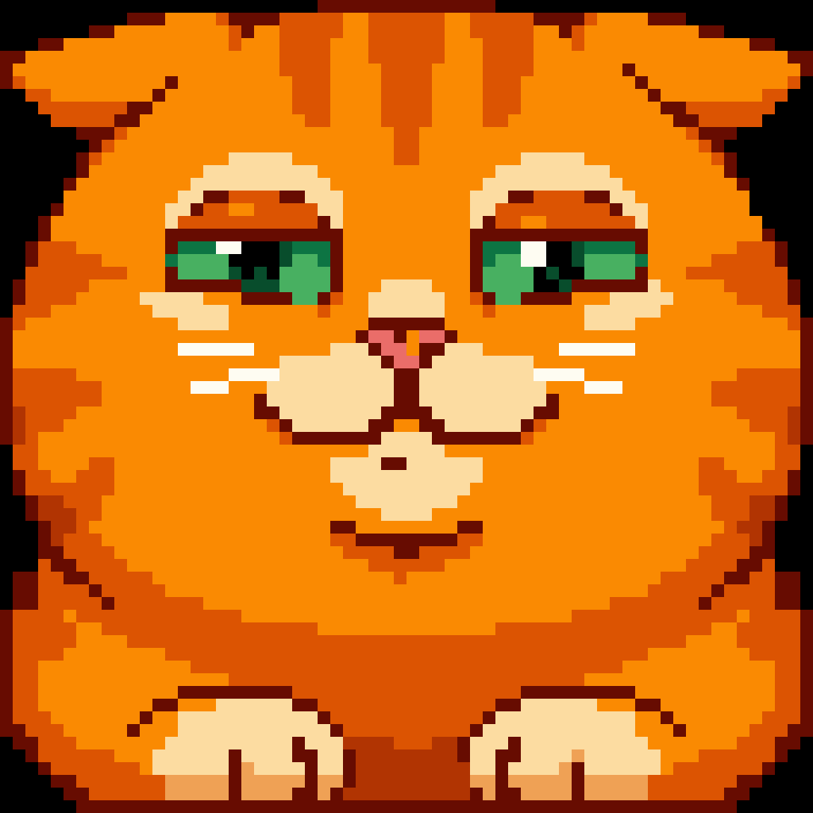

# Square Cat: LED visuals for a Pixoo 64

Pixel art for a 64×64 LED matrix (Divoom Pixoo 64). Nano Banana 2 (Gemini 3.1 Flash Image) generates it, a small Pillow script snaps it to a true 64×64 grid, and [Jixoo](https://github.com/glaforge/jixoo) checks it and puts it on the device.

| Nano Banana 2 render | Entry: the 64×64 frame, one 16×16 block per LED |
|:---:|:---:|
|  |  |

Only square files were accepted, so the cat made itself square, squeezing into the display the way cats squeeze into boxes that are too small.

## Pipeline

**1. Generate.** The prompt is [`prompts/base.txt`](prompts/base.txt) (the LED rules: one pixel grid, flat colours, black background, no text) followed by one scene file from [`prompts/`](prompts/).

```bash
export GEMINI_API_KEY=...
python3 generate.py square_cat            # -> visuals/square_cat.png
```

`generate.py` sends the Interactions API request from Jixoo's [RECIPES.md](https://github.com/glaforge/jixoo/blob/main/RECIPES.md). Pasting the two prompt files into the Gemini app or AI Studio works too.

**2. Snap to the LED grid.** Image models draw "fake" pixel art: anti-aliased edges, noise, and a grid of their own choosing (this render used 50×50 art pixels, not 64).

```bash
python3 pixoo64.py visuals/square_cat.png --despeckle
```

- quantises the full-size render to at most 16 colours with an octree, so small accents like the eyes and nose survive
- gives each LED the most common colour of its 16×16 block
- turns near-black into `#000000`, so LEDs that should be off stay off
- `--despeckle` removes isolated single pixels; leave it off if the art has deliberate one-pixel stars or glints
- writes `_64.png` (exactly what the LEDs show) and `_1024.png` (the same pixels ×16 with hard edges: the file to upload)

It only needs Pillow (`pip install pillow`).

**3. Check with Jixoo.** Build Jixoo (`mvn package` in a clone), then run its own resize code on the upload and compare the LEDs with the 64×64 frame:

```bash
java -cp path/to/jixoo/target/jixoo64-0.3.0-cli.jar VerifyWithJixoo.java visuals/square_cat
# OK: Jixoo shows visuals/square_cat_1024.png as exactly visuals/square_cat_64.png (4096 LEDs)
```

**4. Display with Jixoo.**

```bash
pixoo-cli -H <pixoo-ip> image visuals/square_cat_1024.png
```

## Why upload 1024×1024 rather than 64×64

On the display both look the same: every LED is a flat 16×16 block, so Jixoo's resize lands back on exactly the 64×64 frame (step 3). The difference is the judge. Gemini looks at the file, not the LEDs, and a 64×64 file has to be enlarged before it is looked at, which usually blurs it. The 1024 file is already enlarged with hard edges, and it weighs 7.5 KB.

## Files

| Path | Purpose |
|---|---|
| `prompts/` | shared LED rules and one scene per visual |
| `generate.py` | Nano Banana 2 request, writes `visuals/<scene>.png` |
| `pixoo64.py` | snaps a render to the 64×64 LED grid |
| `VerifyWithJixoo.java` | checks an upload with Jixoo's own resize code |
| `visuals/` | raw renders, `_64` LED frames and `_1024` uploads |

## Credits

- [Jixoo](https://github.com/glaforge/jixoo) by Guillaume Laforge: the Pixoo 64 Java library and CLI, and the Gemini recipes this pipeline follows
- Nano Banana 2 (Gemini 3.1 Flash Image) by Google
